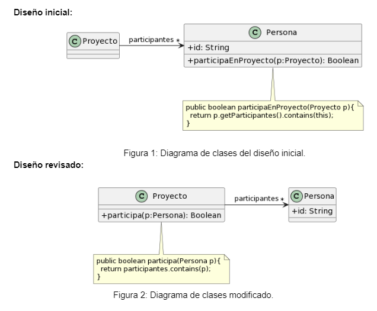

# Ejercicio 1: Algo huele mal
Indique qué malos olores se presentan en los siguientes ejemplos.		

## 1.1 Protocolo de Cliente
La clase Cliente tiene el siguiente protocolo. ¿Cómo puede mejorarlo? 

```java
/** 
* Retorna el límite de crédito del cliente
*/
protected double lmtCrdt() {...

/** 
* Retorna el monto facturado al cliente desde la fecha f1 a la fecha f2
*/
protected double mtFcE(LocalDate f1, LocalDate f2) {...

/** 
* Retorna el monto cobrado al cliente desde la fecha f1 a la fecha f2
*/
protected double mtCbE(LocalDate f1, LocalDate f2) {...
```

### Rename Method
```java
protected double limiteCredito() {...

protected double montoFacturadoEntre(LocalDate f1, LocalDate f2) {...

protected double montoCobradoEntre(LocalDate f1, LocalDate f2) {...
```


## 1.2 Participación en proyectos 
Al revisar el siguiente diseño inicial (Figura 1), se decidió realizar un cambio para evitar lo que se consideraba un mal olor. El diseño modificado se muestra en la Figura 2. Indique qué tipo de cambio se realizó y si lo considera apropiado. Justifique su respuesta.



Se delegó a la clase "Proyecto" el determinar si una persona está en un proyecto específico, ya que antes lo hacía la clase "Persona", pero con los atributos de "Proyecto" (Feature Envy). Lo considero apropiado porque "Persona" le estaba quitando responsabilidad a "Proyecto", además es más natural preguntar a "Proyecto" si tal persona está involucrada.


## 1.3 Cálculos 
Analice el código que se muestra a continuación. Indique qué code smells encuentra y cómo pueden corregirse.						

```java
public void imprimirValores() {
	int totalEdades = 0;
	double promedioEdades = 0;
	double totalSalarios = 0;
	
	for (Empleado empleado : personal) {
		totalEdades = totalEdades + empleado.getEdad();
		totalSalarios = totalSalarios + empleado.getSalario();
	}
	promedioEdades = totalEdades / personal.size();
		
	String message = String.format("El promedio de las edades es %s y el total de salarios es %s", promedioEdades, totalSalarios);
	
	System.out.println(message);
}
```
Code Smells:
- Nombres poco descriptivos
- Metodo Largo (realiza varias tareas)

Correción:

```java
public void imprimirValores() {	
	String message = String.format("El promedio de las edades es %s y el total de salarios es %s", promedioEdades(), totalSalarios());

	System.out.println(message);
}

private double promedioEdades() {
	return totalEdades / personal.size();
}

private int totalEdades() {
	int totalEdades = 0;
	for (Empleado empleado : personal) {
		totalEdades = totalEdades + empleado.getEdad();
	}
	return totalEdades;
}

private double totalSalarios() {
	double totalSalarios = 0;
	for (Empleado empleado : personal) {
		totalSalarios = totalSalarios + empleado.getSalario();
	}
	return totalSalarios;
}
```
